# Module 2: Supervised Learning - Linear Regression Basics 📈

Welcome to Module 2! Now that you understand the fundamentals of Machine Learning, let's dive into your first algorithm: **Linear Regression**. This is where theory meets practice!

## 📚 Table of Contents
- [Lecture 1: Model Representation](#lecture-1-model-representation)
  - [What is Supervised Learning? (Recap)](#what-is-supervised-learning-recap)
  - [Introduction to Linear Regression](#introduction-to-linear-regression)
  - [Training Set & Notation](#training-set--notation)
  - [How the Learning Algorithm Works](#how-the-learning-algorithm-works)
  - [The Hypothesis Function](#the-hypothesis-function)
  - [Why Start with Linear Regression?](#why-start-with-linear-regression)
- [Lecture 2: Cost Function](#lecture-2-cost-function)
  - [Understanding Parameters](#understanding-parameters)
  - [The Parameter Problem](#the-parameter-problem)
  - [What is a Cost Function?](#what-is-a-cost-function)
  - [Squared Error Cost Function](#squared-error-cost-function)
  - [Mathematical Formulation](#mathematical-formulation)
- [Lecture 3: Cost Function - Intuition I](#lecture-3-cost-function---intuition-i)
  - [Simplified Hypothesis for Better Understanding](#simplified-hypothesis-for-better-understanding)
  - [Two Key Functions to Understand](#two-key-functions-to-understand)
  - [Step-by-Step Examples](#step-by-step-analysis-complete-examples)
  - [Building the Cost Function Curve](#building-the-complete-cost-function)
  - [Finding the Optimal Parameter](#the-optimization-objective)
- [Key Takeaways](#key-takeaways)

---

## Lecture 1: Model Representation

### What is Supervised Learning? (Recap)

### 🎯 Quick Reminder
**Supervised Learning** = Learning with a teacher who has the answer key

- We train a model using data where we **already know the correct answers** (labels)
- **Goal**: Learn the relationship between input (X) and output (Y)
- **Purpose**: Make accurate predictions on new, unseen data

### 🎭 Two Main Types

| **Type** | **Predicts** | **Example** | **Output** |
|----------|--------------|-------------|------------|
| **Regression** 📊 | Continuous values | House prices | $245,673.21 |
| **Classification** 🏷️ | Discrete categories | Email type | Spam or Not Spam |

### 💡 Think of it Like This
- **Regression**: "How much?" (any number)
- **Classification**: "Which category?" (fixed options)

---

### Introduction to Linear Regression

### 🏠 Real-World Example: Predicting House Prices

Let's use a concrete example that everyone can relate to!

#### 📍 The Scenario
You're helping a friend figure out how much their house might be worth in **Portland, Oregon**.

#### 📊 The Data
- **Input (X)**: Size of the house in square feet
- **Output (Y)**: Price of the house in dollars

#### 🎯 The Question
*"If my friend's house is 1,250 sq ft, what should I expect it to cost?"*

#### 🔮 The Goal
Build a model that can predict house prices based on size, so you can give your friend a reasonable estimate.

### 🧠 Why This is Regression
- House prices can be **any number**: $245,673.21, $245,673.22, etc.
- We're predicting a **continuous value**, not choosing from fixed categories
- The price smoothly increases/decreases with house size

---

### Training Set & Notation

### 📚 What is a Training Set?
The **training set** is the collection of examples we use to teach our algorithm.

Think of it like a **textbook with answer sheets** - it contains both questions (house sizes) and correct answers (actual prices).

### 🏠 Example Training Set
Let's say we collected data on **47 houses** in Portland:

| House # | Size (sq ft) | Price |
|---------|--------------|-------|
| 1 | 2,104 | $460,000 |
| 2 | 1,416 | $232,000 |
| 3 | 1,534 | $315,000 |
| ... | ... | ... |
| 47 | 852 | $178,000 |

### 📝 Mathematical Notation

Understanding the "language" of machine learning:

| **Symbol** | **Meaning** | **Example** |
|------------|-------------|-------------|
| **m** | Number of training examples | m = 47 (we have 47 houses) |
| **x** | Input feature | x = house size in sq ft |
| **y** | Output label | y = price in dollars |
| **(x⁽ⁱ⁾, y⁽ⁱ⁾)** | The i-th training example | (x⁽¹⁾, y⁽¹⁾) = (2,104 sq ft, $460,000) |

### 🎯 Reading the Notation
- **(x⁽¹⁾, y⁽¹⁾)** = First house: 2,104 sq ft, costs $460,000
- **(x⁽²⁾, y⁽²⁾)** = Second house: 1,416 sq ft, costs $232,000
- **(x⁽⁴⁷⁾, y⁽⁴⁷⁾)** = 47th house: 852 sq ft, costs $178,000

> **Note**: The superscript (i) refers to the example number, not exponentiation!

---

### How the Learning Algorithm Works

### 🔄 The Learning Process

Think of this like teaching someone to estimate house prices:

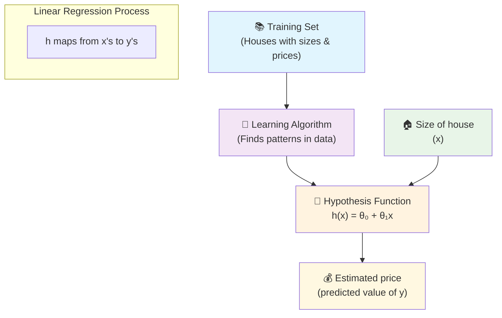

### 🎯 Step-by-Step Process

#### 1. **Feed Training Data** 📊
- Show the algorithm 47 houses with their sizes and actual prices
- Algorithm studies the relationship between size and price

#### 2. **Find the Pattern** 🔍
- Algorithm notices: "Bigger houses tend to cost more"
- Discovers the mathematical relationship between size and price

#### 3. **Create Predictor Function** 🔮
- Algorithm creates a function `h(x)` (called "hypothesis")
- This function can predict price for any house size

#### 4. **Make Predictions** 🎯
- Input: New house size (1,250 sq ft)
- Output: Predicted price (~$220,000)

### 💡 Real-Life Analogy
It's like learning to estimate pizza prices:
- You observe many pizza shops (training data)
- You notice patterns: bigger pizzas cost more
- You develop a mental formula: "12-inch pizza ≈ $15, 16-inch ≈ $20"
- Now you can estimate the price of any pizza size

---

### The Hypothesis Function

### 🎯 What is a Hypothesis?
The **hypothesis** is our prediction function - it's the "brain" that makes predictions.

For linear regression, it's represented as:

### 📐 The Mathematical Formula

```
h_θ(x) = θ₀ + θ₁x
```

### 🧩 Understanding the Components

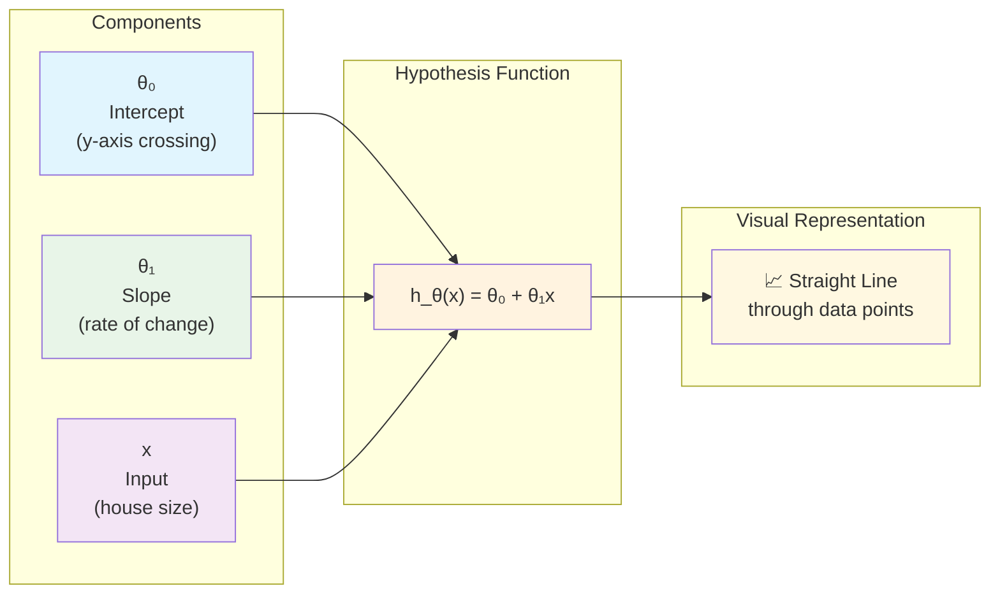

### 🧩 Breaking Down the Formula

| **Component** | **Name** | **What it Does** | **House Price Example** |
|---------------|----------|------------------|-------------------------|
| **θ₀** (theta zero) | **Intercept** | Starting point of the line | Base price: $50,000 |
| **θ₁** (theta one) | **Slope** | How much y changes per unit of x | +$150 per sq ft |
| **x** | **Input** | The feature we're using | House size: 1,250 sq ft |
| **h_θ(x)** | **Prediction** | The output prediction | Predicted price |

### 🏠 Example Calculation

Let's say our algorithm learned:
- **θ₀ = 50,000** (base price)
- **θ₁ = 150** (price per sq ft)

For a 1,250 sq ft house:
```
h_θ(1250) = 50,000 + 150 × 1,250
h_θ(1250) = 50,000 + 187,500
h_θ(1250) = $237,500
```

### 📈 Visualizing the Line - Univariate Linear Regression Example

The hypothesis creates a **straight line** through your data:

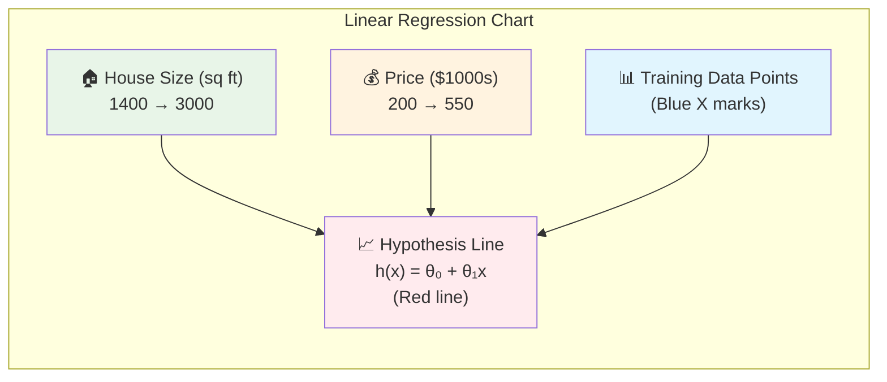

**Linear Regression Visualization:**

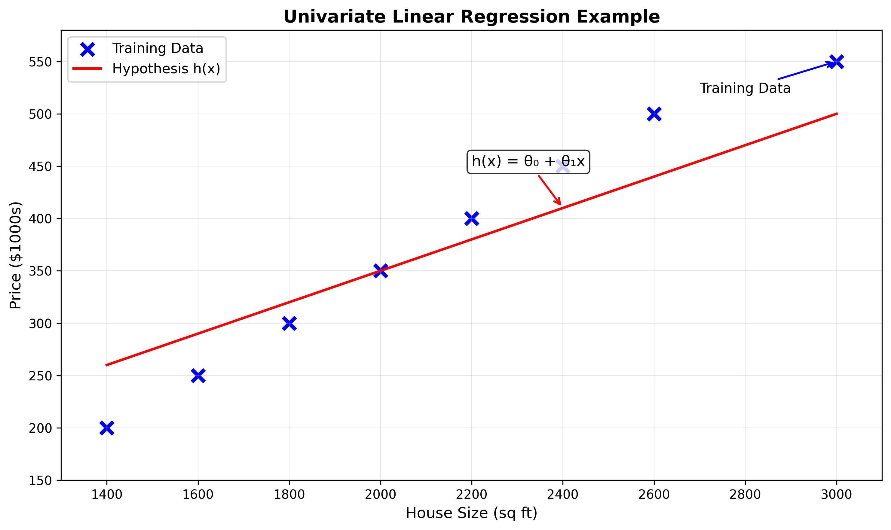

*Professional chart showing the relationship between house size and price with the linear regression line*

**Key Elements:**
- 🔵 **Blue X marks**: Training Data (actual house prices)
- 🔴 **Red line**: Hypothesis h(x) = θ₀ + θ₁x (best fit line)
- 📊 **Linear relationship**: As house size increases, price increases proportionally
- 🎯 **Goal**: Line minimizes distance to all data points

### 🧩 Formula Breakdown

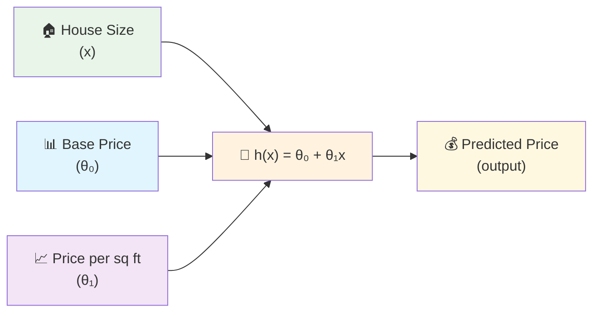

**h_θ(x) = θ₀ + θ₁x** (Shorthand: **h(x)**)

**Component Breakdown:**
- **θ₀** = y-intercept (base price when size = 0)
- **θ₁** = slope (price increase per sq ft)  
- **x** = house size (input)
- **h(x)** = predicted price (output)

> Example (using simple numbers like in the image):
>
> - Base price (θ₀): 150 (think of this as $150k)
> - Price per sq ft (θ₁): 0.1875 (i.e., $187.5 per sq ft)
> - House size (x): 2,400 sq ft
>
> How we got θ₁ = 0.1875 (slope):
> - Pick any two clear points on the red line (from the image), for example (1400, 200) and (3000, 500)
> - Slope = rise ÷ run = (500 − 200) ÷ (3000 − 1400) = 300 ÷ 1600 = 0.1875
>
> Slope formulas (θ₁ = m):
>
> m = (y2 − y1) / (x2 − x1)
>
> m = rise / run

> Slope from two points (visual):
>
> 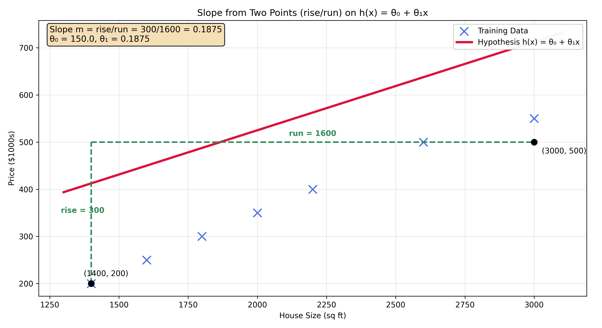
>
> Calculation:
>
> h(x) = θ₀ + θ₁x = 150 + 0.1875 × 2400 = 150 + 450 = 600  → about $600k

**Visual Representation:**

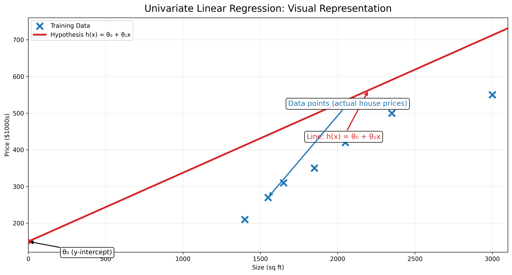

Shorthand: h(x) = θ₀ + θ₁x

### 🎯 Why It's Called "Linear"
- Creates a **straight line** (not curved)
- Relationship between x and y is **linear** (proportional)

### 📛 Technical Name
**Univariate Linear Regression**
- **Uni** = One
- **Variate** = Variable  
- **Linear** = Straight line
- **Regression** = Predicting continuous values

Translation: "Using one variable to predict continuous values with a straight line"

---

### Why Start with Linear Regression?

### 🏗️ Building Strong Foundations

Think of linear regression as learning to walk before you run:

#### 1. **Simplicity** 🎯
- Easiest ML algorithm to understand
- Clear visual representation (just a line!)
- Perfect for learning core concepts

#### 2. **Foundation for Everything** 🏛️
- Concepts learned here apply to ALL ML algorithms
- Understanding linear regression helps with:
  - Polynomial regression (curved lines)
  - Multiple variable regression
  - Neural networks
  - Deep learning

#### 3. **Real-World Usefulness** 💼
- Surprisingly powerful for many problems
- Used in business, science, and engineering
- Fast and efficient

#### 4. **Mathematical Understanding** 🔢
- Introduces key concepts:
  - Cost functions
  - Optimization
  - Gradient descent
  - Model evaluation

### 🎨 Analogy: Learning to Draw
- **Linear Regression** = Learning to draw straight lines
- **Advanced ML** = Creating complex artwork
- You need to master straight lines before creating masterpieces!

---

## Key Takeaways

### 🎯 Core Concepts Mastered

#### **Regression vs Classification** 🎭
- **Regression** → Continuous values (any number)
  - Examples: $220,000, 23.7°C, 1,247 units sold
- **Classification** → Discrete categories (fixed options)  
  - Examples: Spam/Not Spam, Cat/Dog/Bird, Pass/Fail

#### **Training Set** 📚
- Collection of examples with known answers
- Used to teach the algorithm patterns
- Notation: m = number of examples

#### **Hypothesis Function** 🔮
- The "predictor" created by the algorithm
- For linear regression: h_θ(x) = θ₀ + θ₁x
- Takes input (x) and produces prediction

#### **Linear Regression Fundamentals** 📈
- Simplest form of regression
- Creates a straight line through data
- Foundation for more complex algorithms

### 🧠 Mental Models to Remember

#### **The Learning Process**
```
Data → Algorithm → Predictor Function → Predictions
```

#### **The House Price Formula**
```
Predicted Price = Base Price + (Price per sq ft × House Size)
```

#### **Notation Guide**
- **x** = input (what you measure)
- **y** = output (what you predict)  
- **θ** = parameters (what the algorithm learns)
- **h** = hypothesis (the prediction function)

### 🚀 What's Coming Next

Now that you understand linear regression basics, you're ready for:
- **Cost Functions**: How to measure prediction accuracy
- **Gradient Descent**: How algorithms learn the best θ values
- **Multiple Features**: Using more than just house size
- **Model Evaluation**: Determining if your model is good

### 💪 Practice Opportunity

Try thinking about other linear relationships:
- Study hours → Test scores
- Exercise time → Weight loss
- Advertising spend → Sales revenue
- Years of experience → Salary

Each follows the same pattern: **y = θ₀ + θ₁x**

---

## Lecture 2: Cost Function

Now that we understand what a hypothesis function is, the big question becomes: **How do we choose the best values for θ₀ and θ₁?** This is where the cost function comes in!

### 🎯 The Big Picture

In Lecture 1, we learned that our hypothesis is:
**h_θ(x) = θ₀ + θ₁x**

But we never answered: How do we find the best θ₀ and θ₁ values? Lecture 2 solves this fundamental problem.

### Understanding Parameters

#### 📊 Our Training Set (Real Example)

Let's look at our housing data with m = 47 training examples:

| **Size in feet² (x)** | **Price ($) in 1000's (y)** |
|------------------------|------------------------------|
| 2104 | 460 |
| 1416 | 232 |
| 1534 | 315 |
| 852 | 178 |
| ... | ... |

*Note: m = 47 means we have 47 house examples in our training set*

#### 🔧 Parameters are the "Knobs" We Can Turn

Think of θ₀ and θ₁ as **adjustment knobs** on our prediction machine:

- **θ₀ (theta zero)**: The **intercept** - where the line crosses the y-axis
- **θ₁ (theta one)**: The **slope** - how steep the line is

**The Question**: Which settings of these "knobs" give us the best predictions?

### The Parameter Problem

#### 🎛️ Different Parameter Values = Different Lines

Let's see what happens when we change our parameters:

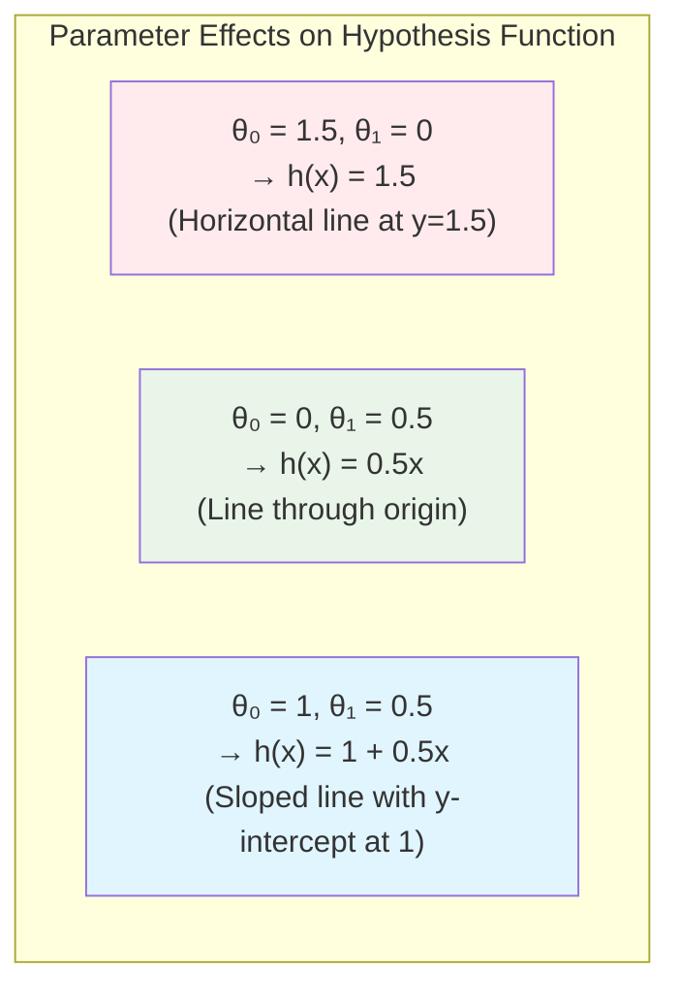

#### 📈 Visual Examples

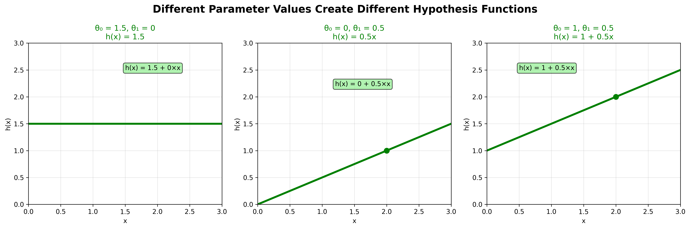

*How different θ₀ and θ₁ values create completely different hypothesis functions*

**Example 1**: θ₀ = 1.5, θ₁ = 0
```
h(x) = 1.5 + 0×x = 1.5
```
This gives us a **flat horizontal line** at y = 1.5 (no matter what house size, we always predict $1,500)

**Example 2**: θ₀ = 0, θ₁ = 0.5  
```
h(x) = 0 + 0.5×x = 0.5x
```
This gives us a **line through the origin** that goes up 0.5 for every 1 unit of x

**Example 3**: θ₀ = 1, θ₁ = 0.5
```
h(x) = 1 + 0.5×x
```
This gives us a **sloped line** starting at y = 1 and going up 0.5 for every 1 unit of x

#### 🤔 The Core Problem

**With infinite possible values for θ₀ and θ₁, how do we pick the BEST ones?**

We need a way to measure "how good" our line fits the data. This is where the **cost function** comes to the rescue!

### What is a Cost Function?

#### 💡 The Basic Idea

**Goal**: Choose θ₀ and θ₁ so that h_θ(x) is close to y for our training examples.

Think of it like this:
- You have actual house prices (y values)
- Your hypothesis makes predictions (h_θ(x) values)  
- A **cost function** measures how far off your predictions are

#### 🎯 The Intuitive Approach

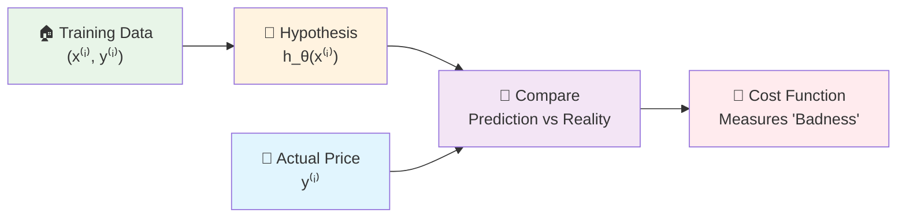

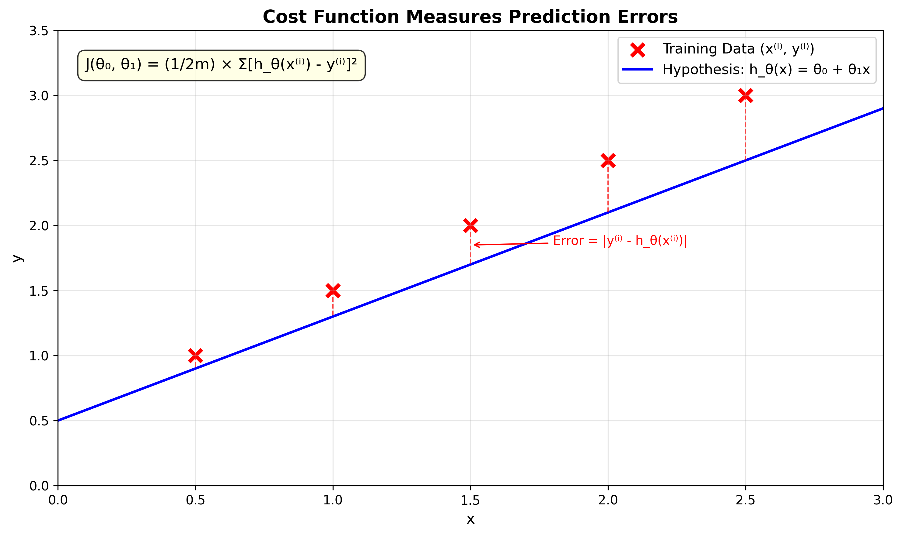

*The cost function measures how far our predictions are from the actual values*

**For each house in our training set:**
1. **Input**: House size x⁽ⁱ⁾
2. **Prediction**: h_θ(x⁽ⁱ⁾) = θ₀ + θ₁x⁽ⁱ⁾
3. **Reality**: Actual price y⁽ⁱ⁾  
4. **Error**: How far off we were = |h_θ(x⁽ⁱ⁾) - y⁽ⁱ⁾|

### Squared Error Cost Function

#### 🧮 The Mathematical Formula

**We can measure the accuracy of our hypothesis function by using a cost function.** This takes an average difference (actually a fancier version of an average) of all the results of the hypothesis with inputs from x's and the actual output y's.

The **cost function J(θ₀, θ₁)** measures the total "badness" of our parameter choices:

```
J(θ₀, θ₁) = (1/2m) × Σ(i=1 to m) [h_θ(x⁽ⁱ⁾) - y⁽ⁱ⁾]²
```

**Alternative notation you might see:**
```
J(θ₀, θ₁) = (1/2m) × Σ(i=1 to m) [ŷ⁽ⁱ⁾ - y⁽ⁱ⁾]²
```
Where ŷ⁽ⁱ⁾ = h_θ(x⁽ⁱ⁾) (predicted value)

Let's break this down piece by piece:

#### 🧩 Breaking Down the Formula

| **Component** | **Meaning** | **Why It's There** |
|---------------|-------------|-------------------|
| **h_θ(x⁽ⁱ⁾)** | Our prediction for house i | This is what our model thinks |
| **y⁽ⁱ⁾** | Actual price of house i | This is the truth |
| **h_θ(x⁽ⁱ⁾) - y⁽ⁱ⁾** | Prediction error for house i | How wrong we were |
| **[...]²** | Square the error | Makes all errors positive, penalizes big errors more |
| **Σ(i=1 to m)** | Sum over all houses | Add up errors from all training examples |
| **1/2m** | Divide by 2×(number of examples) | Get average error, 1/2 makes math easier later |

#### 🤔 Why Do We Divide by 1/2m? (Beginner Explanation)

This is one of the most confusing parts for beginners! Let's break it down step by step:

**Step 1: Why divide by 'm'?**
- **m** = number of training examples (houses in our dataset)
- We want the **average** error, not the total error
- If we don't divide by m, having more data would always make our cost bigger
- **Example**: 10 houses with $5k average error vs 1000 houses with $5k average error
  - Without dividing: Total errors would be 10×$5k = $50k vs 1000×$5k = $5M
  - After dividing by m: Both give average error of $5k ✅

**Step 2: Why the extra 1/2?**
This is a **mathematical convenience** for calculus (don't worry if this seems advanced):

**The Simple Answer**: It makes the math cleaner when we later find the minimum of this function.

**The Technical Answer**: 
```
d/dx (x²) = 2x
```
When we take the derivative of the squared term, we get a factor of 2. The 1/2 cancels this out, making our final equations simpler.

**Think of it like this**: 
- **(1/m)** = "Give me the average error"  
- **(1/2)** = "Make the math easier for finding the minimum"
- **Combined (1/2m)** = "Give me half the average squared error"

**Important**: The 1/2 doesn't change which θ₀ and θ₁ values are best! It just makes the numbers smaller and the math cleaner.

#### 🎯 Why Square the Errors?

**1. Makes All Errors Positive**
- If we predict $250k and actual is $300k: error = -$50k
- If we predict $350k and actual is $300k: error = +$50k  
- Without squaring, these cancel out! Squaring fixes this.

**2. Penalizes Big Errors More**
- Small error (10k): 10² = 100
- Big error (50k): 50² = 2,500  
- We want to avoid really bad predictions!

**3. Mathematical Convenience**
- Squared functions are smooth and easy to minimize
- No absolute value signs to worry about

#### 🏠 Concrete Example

Let's say we have 3 houses:

| House | Size (x) | Actual Price (y) | Our Prediction h_θ(x) | Error | Error² |
|-------|----------|------------------|----------------------|-------|--------|
| 1 | 1000 | $200k | $180k | -$20k | $400k² |
| 2 | 2000 | $400k | $380k | -$20k | $400k² |  
| 3 | 1500 | $300k | $320k | +$20k | $400k² |

```
J(θ₀, θ₁) = (1/2×3) × (400 + 400 + 400) = (1/6) × 1200 = 200
```

### Mathematical Formulation

#### 📝 The Complete Cost Function

**Formal Definition**:
```
J(θ₀, θ₁) = (1/2m) × Σ(i=1 to m) [h_θ(x⁽ⁱ⁾) - y⁽ⁱ⁾]²
```

Where:
- **h_θ(x⁽ⁱ⁾) = θ₀ + θ₁x⁽ⁱ⁾** (our hypothesis function)
- **m** = number of training examples
- **(x⁽ⁱ⁾, y⁽ⁱ⁾)** = i-th training example

#### 🎯 Our Goal (Optimization Problem)

```
minimize J(θ₀, θ₁)
θ₀, θ₁
```

**Translation**: Find the values of θ₀ and θ₁ that make the cost function as small as possible.

#### 🔄 The Complete Picture

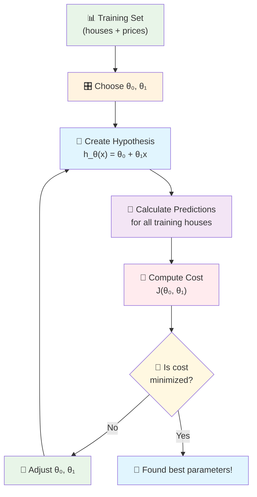

#### 🧠 Intuitive Understanding

**Think of the cost function as a "goodness meter":**
- **Low cost** = Our line fits the data well (good parameters!)
- **High cost** = Our line fits the data poorly (bad parameters!)

**The Process:**
1. **Try different θ₀ and θ₁ values**
2. **For each combination, calculate J(θ₀, θ₁)**  
3. **Find the combination that gives the lowest cost**
4. **Those are our best parameters!**

### 📚 Alternative Names

The cost function has several names you might encounter:

- **Cost Function** ✅ (most common)
- **Squared Error Function** ✅ (instructor's term)
- **Mean Squared Error (MSE)** ✅ (very common)
- **Squared Error Cost Function**  
- **Loss Function**
- **Objective Function**

**From the instructor**: *"This function is otherwise called the 'Squared error function', or 'Mean squared error'."*

#### 🧮 Breaking Down "Mean Squared Error"

Let's understand this term piece by piece:

```
J(θ₀, θ₁) = (1/2m) × Σ(i=1 to m) [h_θ(x⁽ⁱ⁾) - y⁽ⁱ⁾]²
```

**To break it apart, it is (1/2) × x̄ where x̄ is the mean of the squares of h_θ(x⁽ⁱ⁾) - y⁽ⁱ⁾**, or the difference between the predicted value and the actual value.

- **Mean**: We're averaging (Σ divided by m)
- **Squared**: We square each error ([ ]²)  
- **Error**: We measure prediction mistakes (h_θ(x⁽ⁱ⁾) - y⁽ⁱ⁾)
- **1/2**: Mathematical convenience for gradient descent

They all refer to the same concept!

### 🤔 Why This Particular Cost Function?

#### ✅ **Advantages of Squared Error**

1. **Widely Used**: Works well for most regression problems
2. **Mathematical Properties**: Smooth, differentiable, easy to minimize
3. **Interpretable**: Directly measures prediction accuracy
4. **Proven**: Decades of successful applications
5. **Gradient Descent Friendly**: The 1/2 term makes calculus cleaner

#### 🔄 **Connection to Gradient Descent**

**From the instructor**: *"The mean is halved (1/2) as a convenience for the computation of the gradient descent, as the derivative term of the square function will cancel out the 1/2 term."*

**What this means for beginners:**
- **Gradient Descent** is the algorithm we'll learn next that actually finds the minimum
- When we take derivatives (calculus), squared terms give us a factor of 2
- The 1/2 cancels this 2, making our equations much cleaner
- **Result**: Simpler math when finding the best θ₀ and θ₁ values

**Don't worry if this seems advanced** - the key point is that 1/2 makes the optimization algorithm work more smoothly!

#### 🔄 **Other Options Exist**

While squared error is most common, there are alternatives:
- **Mean Absolute Error**: Σ|h_θ(x⁽ⁱ⁾) - y⁽ⁱ⁾|
- **Huber Loss**: Combination of squared and absolute error
- **Custom Functions**: For specific problem requirements

*We'll explore these alternatives later in the course!*

### 🎯 What's Next?

Now that we understand **what** the cost function is, the next questions are:

1. **How do we actually minimize J(θ₀, θ₁)?**
2. **What does this cost function look like visually?**
3. **How do we find the minimum efficiently?**

These questions lead us to **Gradient Descent** - the algorithm that actually finds the best parameters!

### 💡 Key Insights

#### **🎯 The Core Problem**
- We need to choose θ₀ and θ₁ to make good predictions
- "Good" means close to actual house prices in our training set

#### **📏 The Measurement Tool**  
- Cost function J(θ₀, θ₁) measures how "bad" our parameters are
- Lower cost = better fit to training data

#### **🎛️ The Optimization Goal**
- Find θ₀ and θ₁ that minimize J(θ₀, θ₁)  
- This gives us the "best" straight line through our data

#### **🧮 The Mathematical Approach**
- Use squared errors to measure badness
- Average over all training examples
- Result: smooth function we can minimize

---

## Lecture 3: Cost Function - Intuition I

In the previous lecture, we gave the mathematical definition of the cost function. In this lecture, let's look at some examples to get intuition about **what the cost function is doing and why we want to use it**.

### 🎯 The Big Picture

From Lecture 2, we learned:
- **Hypothesis**: h_θ(x) = θ₀ + θ₁x
- **Cost Function**: J(θ₀, θ₁) = (1/2m) × Σ[h_θ(x⁽ⁱ⁾) - y⁽ⁱ⁾]²
- **Goal**: minimize J(θ₀, θ₁) to find the best fit line

But **how does this actually work visually?** Lecture 3 builds the intuition!

### Simplified Hypothesis for Better Understanding

#### 🔧 Why Simplify?

To better visualize and understand the cost function, we'll work with a **simplified hypothesis function**:

```
h_θ(x) = θ₁x    (instead of θ₀ + θ₁x)
```

**What this means:**
- We're setting **θ₀ = 0** (no y-intercept)
- Our line **must pass through the origin** (0, 0)
- We only have **one parameter** θ₁ to worry about

#### 📊 Simplified vs Original

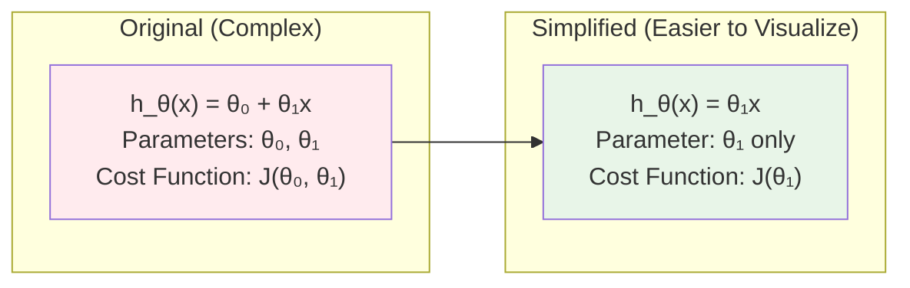

#### 🎨 Visual Comparison

**Original**: Lines can start anywhere on the y-axis
**Simplified**: All lines must pass through (0, 0)

This simplification helps us understand the core concept without getting overwhelmed by two parameters.

### Two Key Functions to Understand

#### 🧠 Critical Distinction

There are **two different functions** we need to understand:

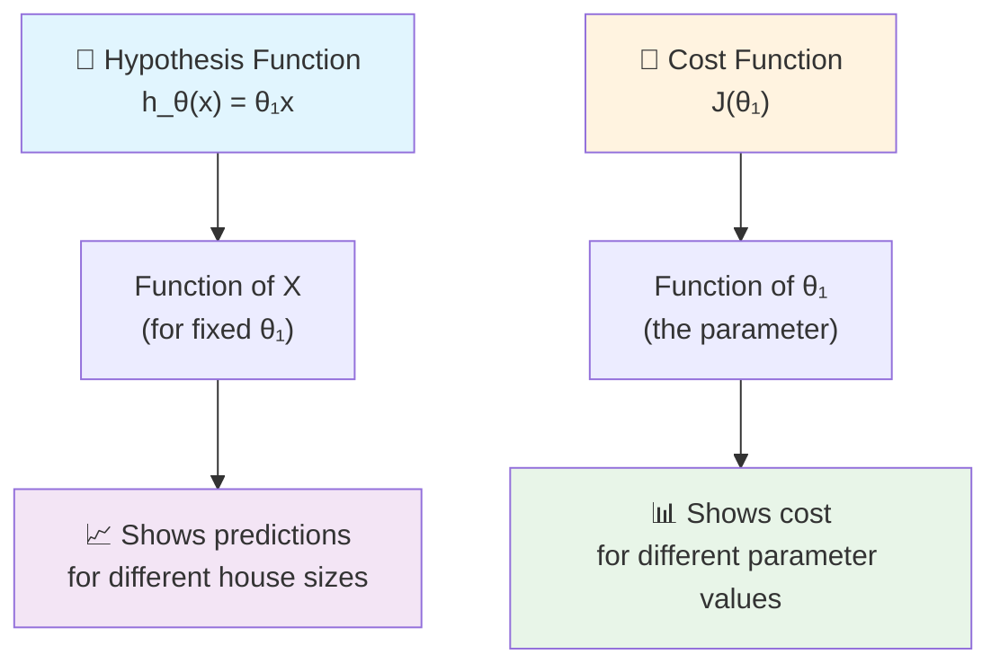

#### 📈 Hypothesis Function: h_θ(x)
- **Input**: House size (x)
- **Output**: Predicted price
- **What it shows**: For a **fixed value of θ₁**, how predictions change with house size
- **Graph axes**: x-axis = house size, y-axis = predicted price

#### 📊 Cost Function: J(θ₁)  
- **Input**: Parameter value (θ₁)
- **Output**: Cost (how bad our fit is)
- **What it shows**: For **different values of θ₁**, how much error we get
- **Graph axes**: x-axis = θ₁ parameter, y-axis = cost

### Understanding Cost Function Through Examples

#### 🎯 What We're Learning

We've seen the math behind cost functions, but now let's work through real examples to understand **what the cost function actually does** and **why it's so useful** in machine learning.

#### 📊 Our Dataset - Simple and Perfect

We'll use a very simple training set with **3 data points**:

| Example | House Size (x) | House Price (y) | Point |
|---------|----------------|-----------------|-------|
| **1** | 1 | 1 | (1, 1) |
| **2** | 2 | 2 | (2, 2) |
| **3** | 3 | 3 | (3, 3) |

**Why this dataset?** These points make a perfect straight line (y = x), which will help us clearly see when our model is perfect!

#### 🔧 Making Things Simple - One Parameter Only

**Complete linear regression formula:** h_θ(x) = θ₀ + θ₁x
**Our simplified version:** h_θ(x) = θ₁x  

**Why simplify?** We're setting θ₀ = 0 to focus on just one parameter (θ₁). This means:
- Our line **must pass through the origin** (point 0,0)
- We only need to find the **best slope** (θ₁)
- It's easier to visualize and understand

### Two Important Functions to Understand

#### 📈 The Key Difference Everyone Gets Confused About

There are **two different functions** in machine learning that students often mix up:

**1. Hypothesis Function h_θ(x) = θ₁ × x**
- **Input**: House size (x)
- **Output**: Predicted price  
- **Purpose**: Makes predictions for new houses
- **Example**: If θ₁ = 1.5, then h_θ(2) = 3 (house size 2 → predicted price 3)

**2. Cost Function J(θ₁) = (1/6) × Σ[θ₁ × x⁽ⁱ⁾ - y⁽ⁱ⁾]²**
- **Input**: Parameter value (θ₁) 
- **Output**: Cost (how bad our predictions are)
- **Purpose**: Measures how good our model is
- **Example**: If θ₁ = 1.5, then J(1.5) = 0.58 (this θ₁ gives cost 0.58)

**Simple way to remember:**
- **Hypothesis**: "Given this house size, what's the price?" 
- **Cost function**: "Given this parameter, how good is our model?"

### Step-by-Step Analysis: Complete Examples

#### 🎯 Example 1: θ₁ = 1.0

Step 1: Set up the hypothesis
h_θ(x) = 1.0 × x

Step 2: Calculate cost J(1.0)

| x | y (actual) | h_θ(x) = 1.0×x | Error: h_θ(x) - y | Error² |
|---|------------|-----------------|-------------------|---------|
| 1 | 1 | 1.0×1 = 1.0 | 1.0 - 1 = 0.0 | (0.0)² = 0.00 |
| 2 | 2 | 1.0×2 = 2.0 | 2.0 - 2 = 0.0 | (0.0)² = 0.00 |
| 3 | 3 | 1.0×3 = 3.0 | 3.0 - 3 = 0.0 | (0.0)² = 0.00 |

**J(1.0) = (1/6) × (0.00 + 0.00 + 0.00) = 0.000** ✨

#### 🎯 Example 2: θ₁ = 0.5

Step 1: Set up the hypothesis
h_θ(x) = 0.5 × x

Step 2: Calculate cost J(0.5)

| x | y (actual) | h_θ(x) = 0.5×x | Error: h_θ(x) - y | Error² |
|---|------------|----------------|-------------------|---------|
| 1 | 1 | 0.5×1 = 0.5 | 0.5 - 1 = -0.5 | (-0.5)² = 0.25 |
| 2 | 2 | 0.5×2 = 1.0 | 1.0 - 2 = -1.0 | (-1.0)² = 1.00 |
| 3 | 3 | 0.5×3 = 1.5 | 1.5 - 3 = -1.5 | (-1.5)² = 2.25 |

**J(0.5) = (1/6) × (0.25 + 1.00 + 2.25) = 3.5/6 = 0.583**

#### 🎯 Example 3: θ₁ = 0

Step 1: Set up the hypothesis
h_θ(x) = 0 × x = 0

Step 2: Calculate cost J(0)

| x | y (actual) | h_θ(x) = 0×x | Error: h_θ(x) - y | Error² |
|---|------------|--------------|-------------------|---------|
| 1 | 1 | 0×1 = 0 | 0 - 1 = -1 | (-1)² = 1.00 |
| 2 | 2 | 0×2 = 0 | 0 - 2 = -2 | (-2)² = 4.00 |
| 3 | 3 | 0×3 = 0 | 0 - 3 = -3 | (-3)² = 9.00 |

**J(0) = (1/6) × (1.00 + 4.00 + 9.00) = 14.0/6 = 2.333**

#### 🎯 Example 4: θ₁ = 1.5

Step 1: Set up the hypothesis
h_θ(x) = 1.5 × x

Step 2: Calculate cost J(1.5)

| x | y (actual) | h_θ(x) = 1.5×x | Error: h_θ(x) - y | Error² |
|---|------------|----------------|-------------------|---------|
| 1 | 1 | 1.5×1 = 1.5 | 1.5 - 1 = 0.5 | (0.5)² = 0.25 |
| 2 | 2 | 1.5×2 = 3.0 | 3.0 - 2 = 1.0 | (1.0)² = 1.00 |
| 3 | 3 | 1.5×3 = 4.5 | 4.5 - 3 = 1.5 | (1.5)² = 2.25 |

**J(1.5) = (1/6) × (0.25 + 1.00 + 2.25) = 3.5/6 = 0.583**

#### 🎯 Example 5: θ₁ = 2.0

Step 1: Set up the hypothesis
h_θ(x) = 2.0 × x

Step 2: Calculate cost J(2.0)

| x | y (actual) | h_θ(x) = 2.0×x | Error: h_θ(x) - y | Error² |
|---|------------|----------------|-------------------|---------|
| 1 | 1 | 2.0×1 = 2.0 | 2.0 - 1 = 1.0 | (1.0)² = 1.00 |
| 2 | 2 | 2.0×2 = 4.0 | 4.0 - 2 = 2.0 | (2.0)² = 4.00 |
| 3 | 3 | 2.0×3 = 6.0 | 6.0 - 3 = 3.0 | (3.0)² = 9.00 |

**J(2.0) = (1/6) × (1.00 + 4.00 + 9.00) = 14.0/6 = 2.333**

#### 🎯 Example 6: θ₁ = -0.5

Step 1: Set up the hypothesis
h_θ(x) = -0.5 × x

Step 2: Calculate cost J(-0.5)

| x | y (actual) | h_θ(x) = -0.5×x | Error: h_θ(x) - y | Error² |
|---|------------|-----------------|-------------------|---------|
| 1 | 1 | -0.5×1 = -0.5 | -0.5 - 1 = -1.5 | (-1.5)² = 2.25 |
| 2 | 2 | -0.5×2 = -1.0 | -1.0 - 2 = -3.0 | (-3.0)² = 9.00 |
| 3 | 3 | -0.5×3 = -1.5 | -1.5 - 3 = -4.5 | (-4.5)² = 20.25 |

**J(-0.5) = (1/6) × (2.25 + 9.00 + 20.25) = 31.5/6 = 5.250**

#### 🎯 Example 7: θ₁ = -1.0

Step 1: Set up the hypothesis
h_θ(x) = -1.0 × x

Step 2: Calculate cost J(-1.0)

| x | y (actual) | h_θ(x) = -1.0×x | Error: h_θ(x) - y | Error² |
|---|------------|-----------------|-------------------|---------|
| 1 | 1 | -1.0×1 = -1.0 | -1.0 - 1 = -2.0 | (-2.0)² = 4.00 |
| 2 | 2 | -1.0×2 = -2.0 | -2.0 - 2 = -4.0 | (-4.0)² = 16.00 |
| 3 | 3 | -1.0×3 = -3.0 | -3.0 - 3 = -6.0 | (-6.0)² = 36.00 |

**J(-1.0) = (1/6) × (4.00 + 16.00 + 36.00) = 56.0/6 = 9.333**

### 📈 Cost Function Curve: Complete Analysis

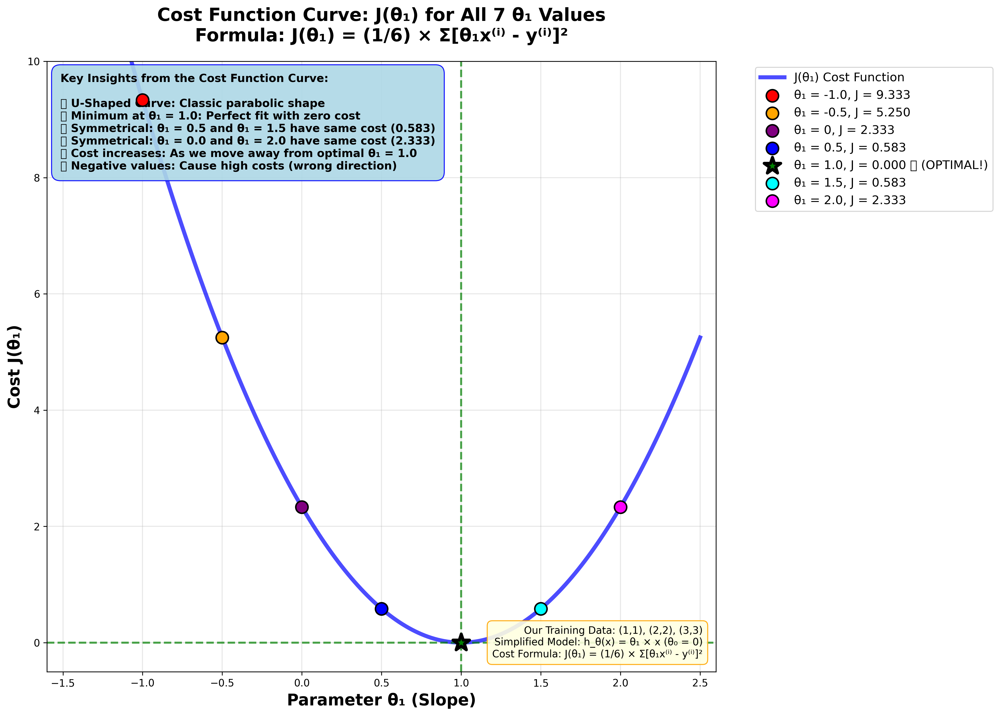
*The complete cost function curve J(θ₁) showing all 7 calculated points - notice the perfect U-shaped curve with minimum at θ₁ = 1.0*

### Building the Complete Cost Function

#### 📈 Creating the J(θ₁) Curve

**What We Discovered by Testing Different Values:**

When we tried many different θ₁ numbers, we found that each one gives us a different cost. This helps us build the complete cost function curve!

**Our Test Results:**

| Parameter θ₁ | Cost J(θ₁) | Performance | Quality Rating |
|----------|------------|-------------|----------------|
| **-1.0** | 9.333 | Extremely Bad | 🔴 Terrible |
| **-0.5** | 5.250 | Very Bad | 🟠 Poor |
| **0.0** | 2.333 | Bad | 🟡 Weak |
| **0.5** | 0.583 | Good | 🔵 Decent |
| **1.0** | **0.000** | **Perfect!** ✨ | 🟢 **Optimal** |
| **1.5** | 0.583 | Good | 🔵 Decent |
| **2.0** | 2.333 | Bad | 🟡 Weak |

**The Simple Rule:**
Each θ₁ number gives us:
- One specific line (hypothesis)
- One specific cost (how good that line is)

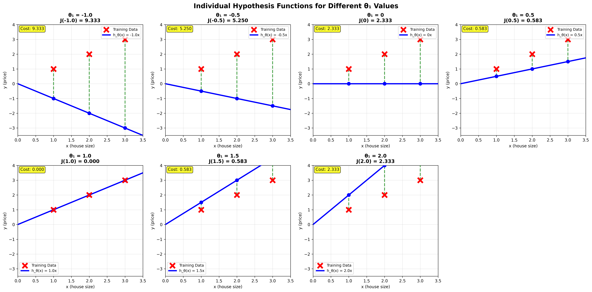
*Visual proof: Each θ₁ value creates a completely different line! The green line (θ₁ = 1.0) perfectly fits all data points.*

**Easy Examples:**
- Pick θ₁ = 1.0 → Draw line "y = x" → Get cost 0 (perfect!)
- Pick θ₁ = 0.5 → Draw line "y = 0.5x" → Get cost 0.58 (okay)
- Pick θ₁ = 0 → Draw line "y = 0" → Get cost 2.33 (poor)

**The Big Idea:** Different parameters → Different lines → Different performance!

#### 📊 Visual Representation

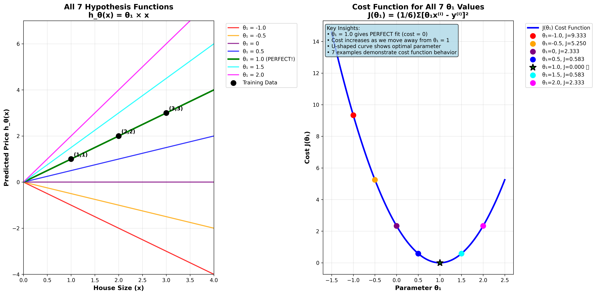

*Left: Different θ₁ values create different hypothesis lines. Right: Each θ₁ produces a different cost J(θ₁). The green star shows the optimal θ₁ = 1.0 with zero cost!*

### The Optimization Objective

#### 🎯 Finding the Best Parameter

**What Are We Actually Trying to Do?**

Our goal is simple: find the parameter θ₁ that gives us the **lowest cost** J(θ₁). This is what machine learning algorithms do - they search for the best parameters.

**Looking at Our Cost Curve Results:**

When we look at our cost function curve, we can see that θ₁ = 1.0 gives us the minimum cost. This isn't just lucky - it makes perfect sense! The line h_θ(x) = x passes exactly through all our data points (1,1), (2,2), (3,3).

**The Big Picture - Why Zero Cost is Perfect:**

For this specific dataset, we get **perfect predictions** with zero errors. This shows us the fundamental principle: **minimizing cost = finding the best line**. When our cost is zero, we have a perfect model!

### 📝 Understanding the Optimization Goal

#### 🎯 The Process: Finding the Best Line

**Our Goal:** Find the θ₁ that minimizes J(θ₁)

The Process:
1. **Try different θ₁ values** → Get different lines
2. **Calculate cost for each line** → Measure how good each fit is  
3. **Pick the θ₁ with lowest cost** → That's our best model

From our calculations:
- θ₁ = 1.0 → Cost = 0.00 (**perfect fit!**) ✨
- θ₁ = 0.5 → Cost = 0.58 (good)
- θ₁ = 0 → Cost = 2.33 (poor)

**Why θ₁ = 1.0 is optimal:** 
Line equation h_θ(x) = 1.0 × x passes exactly through all data points (1,1), (2,2), (3,3), giving zero prediction errors and zero cost.

#### 📊 Complete Analysis Results

| θ₁ | Hypothesis h_θ(x) | Predictions | Errors | Squared Errors Sum | Cost J(θ₁) | Visual Description |
|----|--------------------|-------------|---------|-------------------|------------|-------------------|
| **-1.0** | -1.0x | (-1, -2, -3) | (-2, -4, -6) | 56.00 | **9.333** | 🔴 Extremely bad fit |
| **-0.5** | -0.5x | (-0.5, -1, -1.5) | (-1.5, -3, -4.5) | 31.50 | **5.250** | 🔴 Very bad fit |
| **0.0** | 0 | (0, 0, 0) | (-1, -2, -3) | 14.00 | **2.333** | 🟠 Bad fit |
| **0.5** | 0.5x | (0.5, 1, 1.5) | (-0.5, -1, -1.5) | 3.50 | **0.583** | 🟡 Poor fit |
| **1.0** | 1.0x | (1, 2, 3) | (0, 0, 0) | 0.00 | **0.000** ✨ | 🟢 Perfect! |
| **1.5** | 1.5x | (1.5, 3, 4.5) | (0.5, 1, 1.5) | 3.50 | **0.583** | 🟡 Poor fit |
| **2.0** | 2.0x | (2, 4, 6) | (1, 2, 3) | 14.00 | **2.333** | 🟠 Bad fit |

#### 🎯 Key Insights

Cost Function Pattern:
- **U-shaped curve** with minimum at θ₁ = 1.0
- **Symmetry**: Moving equal distances from θ₁ = 1.0 gives equal costs
- Optimization goal: Find the bottom of the U-curve

Different θ₁ behaviors:
- Negative values: Wrong direction, very high costs
- θ₁ = 0: Flat line, misses all points  
- **θ₁ = 1.0**: Perfect fit through all data points ✨
- θ₁ > 1: Too steep, overpredicts

### Video Summary

**"So, to wrap up. In this video, we looked up some plots. To understand the cost function. To do so, we simplify the algorithm. So that it only had one parameter θ₁. And we set the parameter θ₀ to be only zero. In the next video. We'll go back to the original problem formulation and look at some visualizations involving both θ₀ and θ₁. That is without setting θ₀ to zero."**

#### 📊 Visual Analysis


*Individual graphs showing different θ₁ values and their prediction errors*


*Complete visualization: hypothesis lines (left) and cost function curve (right)*

---

## 🎓 Lecture 3 Summary

### Key Learning Outcomes

Core Concepts:
1. **Function distinction**: h_θ(x) = θ₁ × x (predicts) vs J(θ₁) (measures quality)  
2. Optimization process: Try different θ₁ → Calculate costs → Find minimum
3. Perfect fit: θ₁ = 1.0 gives **zero cost** (line passes through all data points)

Visual Understanding:
- Cost function forms **U-shaped curve** with clear minimum
- Different θ₁ values create different hypothesis lines
- Optimization = finding the **bottom of the U-curve**

### Real-World Application
This same principle applies to ALL machine learning:
- Try different parameters → Measure performance → Pick the best

### Next Lecture Preview
We'll explore the full cost function with both θ₀ and θ₁ parameters for more flexible line fitting!