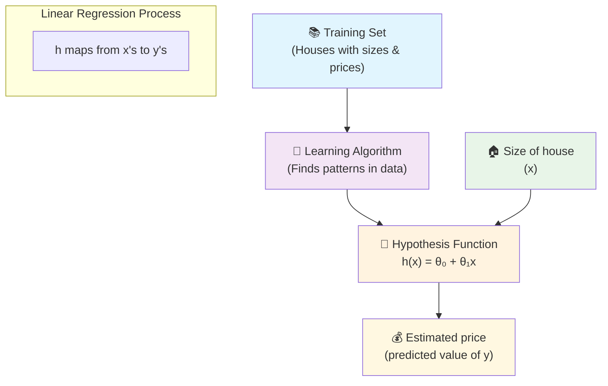
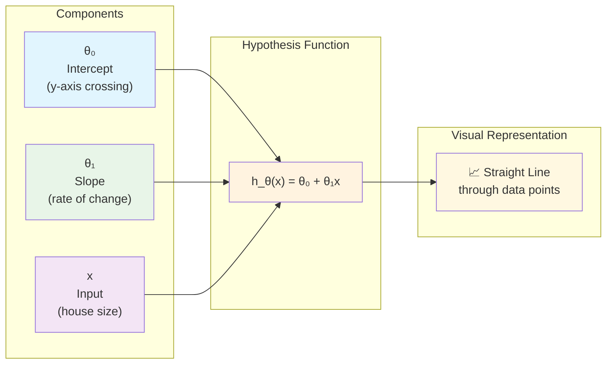
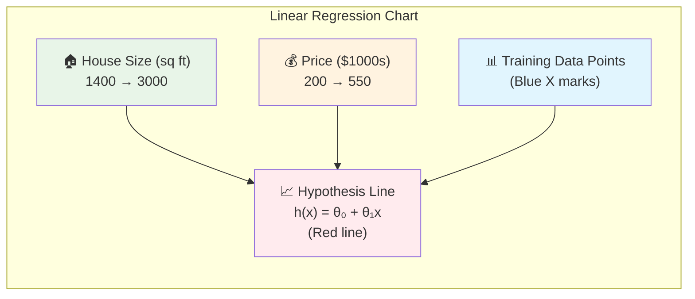
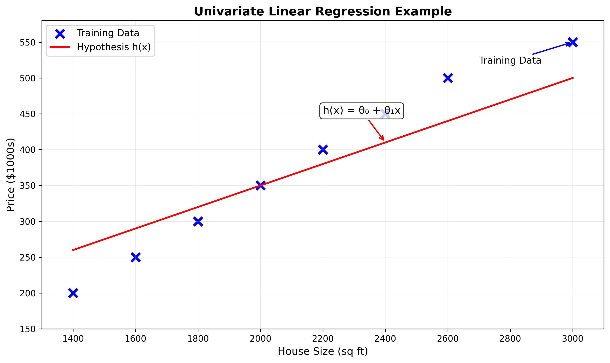
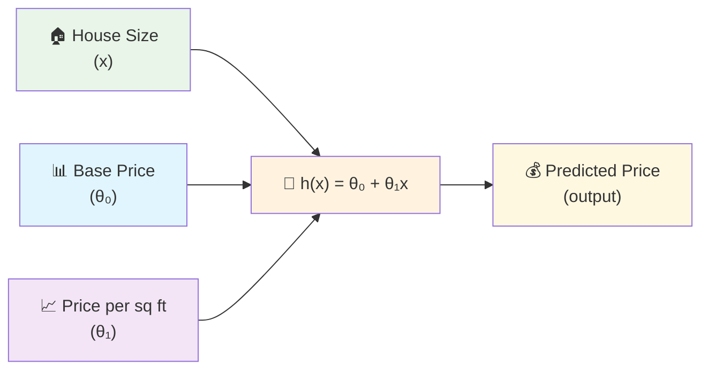

# Module 2: Supervised Learning - Linear Regression Basics 📈

Welcome to Module 2! Now that you understand the fundamentals of Machine Learning, let's dive into your first algorithm: **Linear Regression**. This is where theory meets practice!

## 📚 Table of Contents
- [Lecture 1: Model Representation](#lecture-1-model-representation)
  - [What is Supervised Learning? (Recap)](#what-is-supervised-learning-recap)
  - [Introduction to Linear Regression](#introduction-to-linear-regression)
  - [Training Set & Notation](#training-set--notation)
  - [How the Learning Algorithm Works](#how-the-learning-algorithm-works)
  - [The Hypothesis Function](#the-hypothesis-function)
  - [Why Start with Linear Regression?](#why-start-with-linear-regression)
- [Key Takeaways](#key-takeaways)

---

## Lecture 1: Model Representation

### What is Supervised Learning? (Recap)

### 🎯 Quick Reminder
**Supervised Learning** = Learning with a teacher who has the answer key

- We train a model using data where we **already know the correct answers** (labels)
- **Goal**: Learn the relationship between input (X) and output (Y)
- **Purpose**: Make accurate predictions on new, unseen data

### 🎭 Two Main Types

| **Type** | **Predicts** | **Example** | **Output** |
|----------|--------------|-------------|------------|
| **Regression** 📊 | Continuous values | House prices | $245,673.21 |
| **Classification** 🏷️ | Discrete categories | Email type | Spam or Not Spam |

### 💡 Think of it Like This
- **Regression**: "How much?" (any number)
- **Classification**: "Which category?" (fixed options)

---

### Introduction to Linear Regression

### 🏠 Real-World Example: Predicting House Prices

Let's use a concrete example that everyone can relate to!

#### 📍 The Scenario
You're helping a friend figure out how much their house might be worth in **Portland, Oregon**.

#### 📊 The Data
- **Input (X)**: Size of the house in square feet
- **Output (Y)**: Price of the house in dollars

#### 🎯 The Question
*"If my friend's house is 1,250 sq ft, what should I expect it to cost?"*

#### 🔮 The Goal
Build a model that can predict house prices based on size, so you can give your friend a reasonable estimate.

### 🧠 Why This is Regression
- House prices can be **any number**: $245,673.21, $245,673.22, etc.
- We're predicting a **continuous value**, not choosing from fixed categories
- The price smoothly increases/decreases with house size

---

### Training Set & Notation

### 📚 What is a Training Set?
The **training set** is the collection of examples we use to teach our algorithm.

Think of it like a **textbook with answer sheets** - it contains both questions (house sizes) and correct answers (actual prices).

### 🏠 Example Training Set
Let's say we collected data on **47 houses** in Portland:

| House # | Size (sq ft) | Price |
|---------|--------------|-------|
| 1 | 2,104 | $460,000 |
| 2 | 1,416 | $232,000 |
| 3 | 1,534 | $315,000 |
| ... | ... | ... |
| 47 | 852 | $178,000 |

### 📝 Mathematical Notation

Understanding the "language" of machine learning:

| **Symbol** | **Meaning** | **Example** |
|------------|-------------|-------------|
| **m** | Number of training examples | m = 47 (we have 47 houses) |
| **x** | Input feature | x = house size in sq ft |
| **y** | Output label | y = price in dollars |
| **(x⁽ⁱ⁾, y⁽ⁱ⁾)** | The i-th training example | (x⁽¹⁾, y⁽¹⁾) = (2,104 sq ft, $460,000) |

### 🎯 Reading the Notation
- **(x⁽¹⁾, y⁽¹⁾)** = First house: 2,104 sq ft, costs $460,000
- **(x⁽²⁾, y⁽²⁾)** = Second house: 1,416 sq ft, costs $232,000
- **(x⁽⁴⁷⁾, y⁽⁴⁷⁾)** = 47th house: 852 sq ft, costs $178,000

> **Note**: The superscript (i) refers to the example number, not exponentiation!

---

### How the Learning Algorithm Works

### 🔄 The Learning Process

Think of this like teaching someone to estimate house prices:



### 🎯 Step-by-Step Process

#### 1. **Feed Training Data** 📊
- Show the algorithm 47 houses with their sizes and actual prices
- Algorithm studies the relationship between size and price

#### 2. **Find the Pattern** 🔍
- Algorithm notices: "Bigger houses tend to cost more"
- Discovers the mathematical relationship between size and price

#### 3. **Create Predictor Function** 🔮
- Algorithm creates a function `h(x)` (called "hypothesis")
- This function can predict price for any house size

#### 4. **Make Predictions** 🎯
- Input: New house size (1,250 sq ft)
- Output: Predicted price (~$220,000)

### 💡 Real-Life Analogy
It's like learning to estimate pizza prices:
- You observe many pizza shops (training data)
- You notice patterns: bigger pizzas cost more
- You develop a mental formula: "12-inch pizza ≈ $15, 16-inch ≈ $20"
- Now you can estimate the price of any pizza size

---

### The Hypothesis Function

### 🎯 What is a Hypothesis?
The **hypothesis** is our prediction function - it's the "brain" that makes predictions.

For linear regression, it's represented as:

### 📐 The Mathematical Formula

```
h_θ(x) = θ₀ + θ₁x
```

### 🧩 Understanding the Components



### 🧩 Breaking Down the Formula

| **Component** | **Name** | **What it Does** | **House Price Example** |
|---------------|----------|------------------|-------------------------|
| **θ₀** (theta zero) | **Intercept** | Starting point of the line | Base price: $50,000 |
| **θ₁** (theta one) | **Slope** | How much y changes per unit of x | +$150 per sq ft |
| **x** | **Input** | The feature we're using | House size: 1,250 sq ft |
| **h_θ(x)** | **Prediction** | The output prediction | Predicted price |

### 🏠 Example Calculation

Let's say our algorithm learned:
- **θ₀ = 50,000** (base price)
- **θ₁ = 150** (price per sq ft)

For a 1,250 sq ft house:
```
h_θ(1250) = 50,000 + 150 × 1,250
h_θ(1250) = 50,000 + 187,500
h_θ(1250) = $237,500
```

### 📈 Visualizing the Line - Univariate Linear Regression Example

The hypothesis creates a **straight line** through your data:



**Linear Regression Visualization:**



*Professional chart showing the relationship between house size and price with the linear regression line*

**Key Elements:**
- 🔵 **Blue X marks**: Training Data (actual house prices)
- 🔴 **Red line**: Hypothesis h(x) = θ₀ + θ₁x (best fit line)
- 📊 **Linear relationship**: As house size increases, price increases proportionally
- 🎯 **Goal**: Line minimizes distance to all data points

### 🧩 Formula Breakdown



**h_θ(x) = θ₀ + θ₁x** (Shorthand: **h(x)**)

**Component Breakdown:**
- **θ₀** = y-intercept (base price when size = 0)
- **θ₁** = slope (price increase per sq ft)  
- **x** = house size (input)
- **h(x)** = predicted price (output)

**Visual Representation:**
```
Price ($) 
    ↑
    │        ×  ← Data points (actual house prices)
    │      ×   ×
    │    ×       ×
    │  ×           ×  
    │×     /         ×   ← Line: h(x) = θ₀ + θ₁x
    │    /             
    │  /                
    │/____________________→ Size (sq ft)
   θ₀ (y-intercept)
   
h_θ(x) = θ₀ + θ₁x
Shorthand: h(x)
```

### 🎯 Why It's Called "Linear"
- Creates a **straight line** (not curved)
- Relationship between x and y is **linear** (proportional)

### 📛 Technical Name
**Univariate Linear Regression**
- **Uni** = One
- **Variate** = Variable  
- **Linear** = Straight line
- **Regression** = Predicting continuous values

Translation: "Using one variable to predict continuous values with a straight line"

---

### Why Start with Linear Regression?

### 🏗️ Building Strong Foundations

Think of linear regression as learning to walk before you run:

#### 1. **Simplicity** 🎯
- Easiest ML algorithm to understand
- Clear visual representation (just a line!)
- Perfect for learning core concepts

#### 2. **Foundation for Everything** 🏛️
- Concepts learned here apply to ALL ML algorithms
- Understanding linear regression helps with:
  - Polynomial regression (curved lines)
  - Multiple variable regression
  - Neural networks
  - Deep learning

#### 3. **Real-World Usefulness** 💼
- Surprisingly powerful for many problems
- Used in business, science, and engineering
- Fast and efficient

#### 4. **Mathematical Understanding** 🔢
- Introduces key concepts:
  - Cost functions
  - Optimization
  - Gradient descent
  - Model evaluation

### 🎨 Analogy: Learning to Draw
- **Linear Regression** = Learning to draw straight lines
- **Advanced ML** = Creating complex artwork
- You need to master straight lines before creating masterpieces!

---

## Key Takeaways

### 🎯 Core Concepts Mastered

#### **Regression vs Classification** 🎭
- **Regression** → Continuous values (any number)
  - Examples: $220,000, 23.7°C, 1,247 units sold
- **Classification** → Discrete categories (fixed options)  
  - Examples: Spam/Not Spam, Cat/Dog/Bird, Pass/Fail

#### **Training Set** 📚
- Collection of examples with known answers
- Used to teach the algorithm patterns
- Notation: m = number of examples

#### **Hypothesis Function** 🔮
- The "predictor" created by the algorithm
- For linear regression: h_θ(x) = θ₀ + θ₁x
- Takes input (x) and produces prediction

#### **Linear Regression Fundamentals** 📈
- Simplest form of regression
- Creates a straight line through data
- Foundation for more complex algorithms

### 🧠 Mental Models to Remember

#### **The Learning Process**
```
Data → Algorithm → Predictor Function → Predictions
```

#### **The House Price Formula**
```
Predicted Price = Base Price + (Price per sq ft × House Size)
```

#### **Notation Guide**
- **x** = input (what you measure)
- **y** = output (what you predict)  
- **θ** = parameters (what the algorithm learns)
- **h** = hypothesis (the prediction function)

### 🚀 What's Coming Next

Now that you understand linear regression basics, you're ready for:
- **Cost Functions**: How to measure prediction accuracy
- **Gradient Descent**: How algorithms learn the best θ values
- **Multiple Features**: Using more than just house size
- **Model Evaluation**: Determining if your model is good

### 💪 Practice Opportunity

Try thinking about other linear relationships:
- Study hours → Test scores
- Exercise time → Weight loss
- Advertising spend → Sales revenue
- Years of experience → Salary

Each follows the same pattern: **y = θ₀ + θ₁x**

---

## 🎉 Congratulations!

You've just learned your **first machine learning algorithm**! 🎊

Linear regression might seem simple, but you've actually mastered fundamental concepts that appear in every ML algorithm:
- Training with labeled data
- Learning patterns from examples  
- Creating prediction functions
- Mathematical notation and terminology

**Keep this momentum going** - the next modules will build on these solid foundations!

---

*Ready for more? Let's dive deeper into how these algorithms actually learn! 🚀*