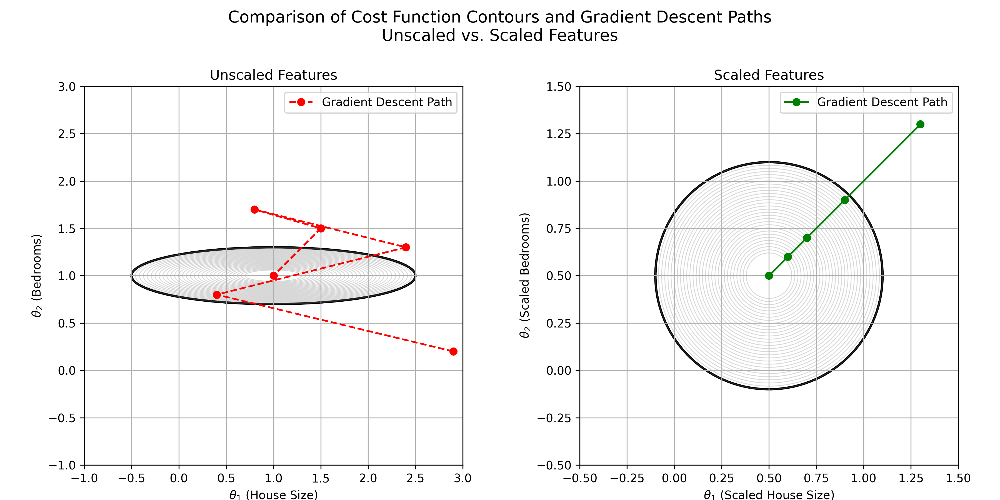
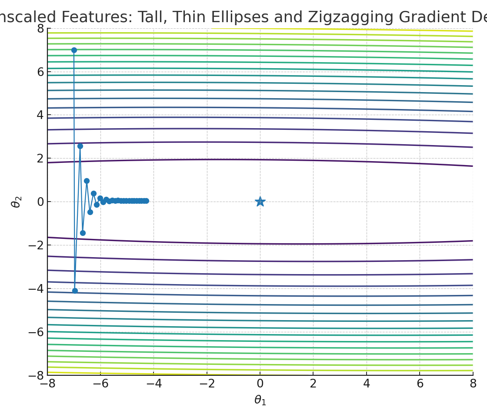
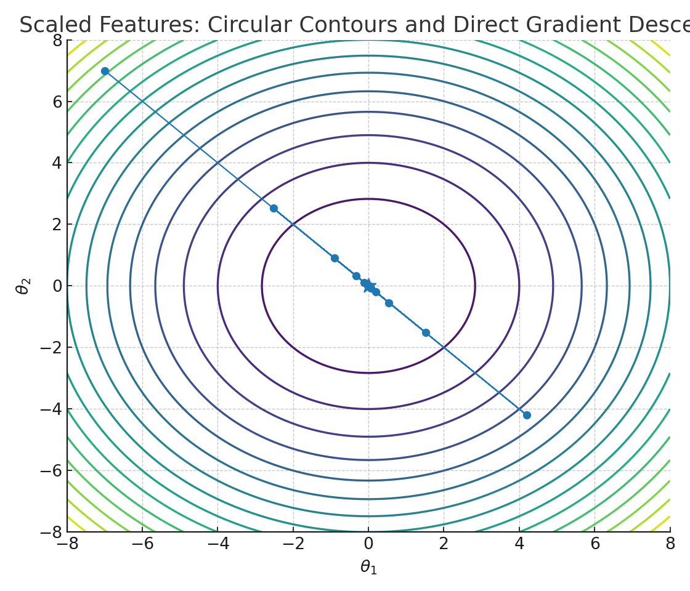

## Module 4: Linear Regression with Multiple Variables

Welcome! In this module we upgrade linear regression to use many features (a.k.a. multiple variables). This is also called multivariate linear regression. You’ll learn clean notation, how to write the hypothesis in vector form, and how to reason about dimensions.

## 📚 Table of Contents
- [Lecture 1: Multiple Features](#lecture-1-multiple-features)
  - [Why multiple features?](#why-multiple-features)
  - [Notation: m, n, x, y](#notation-m-n-x-y)
  - [Feature vectors and indexing](#feature-vectors-and-indexing)
  - [Add a bias feature x₀ = 1](#add-a-bias-feature-x₀--1)
  - [Hypothesis: expanded and vector form](#hypothesis-expanded-and-vector-form)
  - [Shapes at a glance](#shapes-at-a-glance)
  - [Tiny example](#tiny-example)
  - [Key takeaways](#key-takeaways)

- [Lecture 2: Gradient Descent for Multiple Variables](#lecture-2-gradient-descent-for-multiple-variables)
  - [Recap: hypothesis and notation](#recap-hypothesis-and-notation)
  - [Cost function J(θ)](#cost-function-jθ)
  - [Gradient descent (component-wise)](#gradient-descent-component-wise)
  - [Vectorized gradient descent](#vectorized-gradient-descent)
  - [Why this matches the 1-feature case](#why-this-matches-the-1-feature-case)
  - [Pseudocode](#pseudocode)

- [Lecture 3: Gradient Descent in Practice I – Feature Scaling](#lecture-3-gradient-descent-in-practice-i--feature-scaling)
  - [Why scale features?](#why-scale-features)
  - [Target ranges and rules of thumb](#target-ranges-and-rules-of-thumb)
  - [Mean normalization + scaling formula](#mean-normalization--scaling-formula)
  - [Mini example (before/after)](#mini-example-beforeafter)
  - [Practical recipe](#practical-recipe)
  - [Key takeaways (Lecture 3)](#key-takeaways-lecture-3)

---

## Lecture 1: Multiple Features

### Why multiple features?
Single‑feature regression used just one input (e.g., house size) to predict price. Real homes have more signals (bedrooms, bathrooms, age, location). Using multiple features lets the model combine these signals to make better predictions.

### Notation: m, n, x, y
Example dataset (snippet):

| Size (ft²) `x₁` | Bedrooms `x₂` | Floors `x₃` | Age (years) `x₄` | Price `y` ($1000) |
|---:|---:|---:|---:|---:|
| 2104 | 5 | 1 | 45 | 460 |
| 1416 | 3 | 2 | 40 | 232 |
| 1534 | 3 | 2 | 30 | 315 |
|  852 | 2 | 1 | 36 | 178 |
| … | … | … | … | … |

Notes:
- `n = 4` features (`x₁…x₄`).
- `m = 47` examples (rows) in the full dataset.
- The highlighted example in the slide: `x⁽²⁾ = [1416, 3, 2, 40]`, `y⁽²⁾ = 232`.

- `m`: number of training examples (rows in your dataset)
- `n`: number of features per example (columns of inputs)
- `x` (input): features; `y` (output): target value we want to predict

We’ll index training examples with superscripts (position in the dataset) and features with subscripts:
- `x⁽ⁱ⁾`: the input (features) of the `iᵗʰ` training example
- `x⁽ⁱ⁾ⱼ`: value of feature `j` in the `iᵗʰ` training example

Example: if features are `[size, bedrooms, bathrooms, age]` then for the 2nd house:
```
x⁽²⁾ = [1416, 3, 2, 40]
```
Here, `x⁽²⁾₃ = 2` (third feature for example 2).

### Feature vectors and indexing
We treat each training example as a column vector of its features. To keep formulas simple we’ll add a bias feature next.

Example (without bias):
```
x⁽²⁾ = ⎡ 1416 ⎤
       ⎢   3  ⎥
       ⎢   2  ⎥
       ⎣  40  ⎦   (4 × 1)
```

With bias `x₀ = 1`:
```
x⁽²⁾ = ⎡   1  ⎤
       ⎢ 1416 ⎥
       ⎢   3  ⎥
       ⎢   2  ⎥
       ⎣  40  ⎦   (5 × 1)
```

### Add a bias feature x₀ = 1
We define an extra feature that’s always 1:
```
x₀ = 1  for every example
```
This lets the model learn an intercept term `θ₀` naturally. With the bias, each feature vector has `n+1` entries: `[x₀, x₁, …, xₙ]`.

### Hypothesis: expanded and vector form
With multiple features the hypothesis is a weighted sum of all features plus the bias term:

Expanded form (for `n` features):
```
h_θ(x) = θ₀·x₀ + θ₁·x₁ + θ₂·x₂ + ··· + θₙ·xₙ
```

Vector form (compact and preferred):
```
h_θ(x) = θᵀ x
```

$$\begin{align*}h_\theta(x) =\begin{bmatrix}\theta_0 \hspace{2em} \theta_1 \hspace{2em} ... \hspace{2em} \theta_n\end{bmatrix}\begin{bmatrix}x_0 \newline x_1 \newline \vdots \newline x_n\end{bmatrix}= \theta^T x\end{align*}$$


Where
θ = [θ₀, θ₁, …, θₙ]ᵀ   and   x = [x₀, x₁, …, 
xₙ]ᵀ  with  x₀ = 1
```
θᵀ = [ θ₀  θ₁  …  θₙ ]   (1 × (n+1))

θ = ⎡ θ₀ ⎤
    ⎢ θ₁ ⎥
    ⎢  ⋮  ⎥   (n+1 × 1)
    ⎣ θₙ ⎦

x = ⎡ x₀ ⎤
    ⎢ x₁ ⎥
    ⎢  ⋮  ⎥   (n+1 × 1), with x₀ = 1
    ⎣ xₙ ⎦
```

Matrix product equals the hypothesis (a single scalar):
```
[ θ₀  θ₁  …  θₙ ]
⎡ x₀ ⎤
⎢ x₁ ⎥
⎢  ⋮  ⎥  =  h_θ(x)
⎣ xₙ ⎦
```

Side-by-side view:
```
θᵀ = [ θ₀  θ₁  …  θₙ ]      x = ⎡ x₀ ⎤
                                ⎢ x₁ ⎥
                                ⎢  ⋮ ⎥
                                ⎣ xₙ ⎦
h_θ(x) = θᵀ x
h_θ(x) = θ₀·x₀ + θ₁·x₁ + θ₂·x₂ + ··· + θₙ·xₙ
```

From the slide (pulling all pieces together):
```
Define:  x₀ = 1  (bias feature)


x = [x₀, x₁, …, xₙ]ᵀ  ∈ ℝⁿ⁺¹
θ = [θ₀, θ₁, …, θₙ]ᵀ  ∈ ℝⁿ⁺¹

θᵀ = [θ₀, θ₁, …, θₙ]  ∈ ℝ¹×⁽ⁿ⁺¹⁾

h_θ(x) = θ₀x₀ + θ₁x₁ + ··· + θₙxₙ = θᵀ x
```

### Shapes at a glance
```
θᵀ: 1 × (n+1)
x : (n+1) × 1
→ h_θ(x): scalar (1 × 1)
```

### Tiny example
Suppose we use 4 features for houses: size (sqft), bedrooms, bathrooms, age (years). Let
```
θ = [80, 0.10, 0.01, 3.0, −2.0]  (interpreting prices in thousands)
     θ₀   θ₁    θ₂   θ₃   θ₄

x = [1, x₁, x₂, x₃, x₄] = [1, 1416, 3, 2, 40]

h_θ(x) = θᵀx
        = 80 + 0.10·1416 + 0.01·3 + 3.0·2 + (−2.0)·40
        = 80 + 141.6 + 0.03 + 6 − 80
        = 147.63  (thousands)
```
So the predicted price is about 147,630 (same units as the training `y`).

### Key takeaways
- Use `n` for number of features, `m` for number of examples.
- Add a bias feature `x₀ = 1` so the model can learn an intercept `θ₀`.
- Write the hypothesis compactly as `h_θ(x) = θᵀx`.
- Always track shapes; vector form makes implementation and reasoning easier.


## Lecture 2: Gradient Descent for Multiple Variables

### Recap: hypothesis and notation
- Features per example (column vector) with `x₀ = 1`:
  ```
  x = ⎡ x₀ ⎤
      ⎢ x₁ ⎥
      ⎢  ⋮  ⎥
      ⎣ xₙ ⎦
  ```
  Shorthand: you may also see `x = [x₀, x₁, …, xₙ]ᵀ`, where the superscript `ᵀ` means “stack these entries vertically.”

Hypothesis and cost (from the slides):

$$
h_\theta(x) = \theta^{\top} x = \theta_0 x_0 + \theta_1 x_1 + \theta_2 x_2 + \cdots + \theta_n x_n
$$

$$
J(\theta_0, \theta_1, \dots, \theta_n) = \frac{1}{2m}\sum_{i=1}^{m} ( h_\theta(x^{(i)}) - y^{(i)} )^2
$$
- Parameters: `θ = [θ₀, θ₁, …, θₙ]ᵀ`
- Hypothesis: `h_θ(x) = θᵀx`

### Cost function J(θ)
For `m` training examples `(x⁽ⁱ⁾, y⁽ⁱ⁾)`:

$$
J(\theta) = \frac{1}{2m} \sum_{i=1}^{m} \big( h_{\theta}(x^{(i)}) - y^{(i)} \big)^2
$$

What this measures (beginner‑friendly):
- How “bad” the predictions are on average. Bigger errors → bigger `J(θ)`.
- Squaring penalizes large mistakes more than small ones.

Equivalent, readable forms (all the same):


$$
J(\theta) = \frac{1}{2m} \sum_{i=1}^{m} (\theta^{\top} x^{(i)} - y^{(i)})^2
$$


$$
J(\theta) = \frac{1}{2m} \sum_{i=1}^{m} \Big( \sum_{j=0}^{n} \theta_j x_j^{(i)} - y^{(i)} \Big)^2
$$

with $x_0^{(i)}=1$


### Gradient descent (component-wise)
Update each parameter `θⱼ` simultaneously:

$$
\begin{align*} & \text{repeat until convergence:} \ \lbrace \newline \ & \theta_0 := \theta_0 - \alpha \frac{1}{m} \sum\limits_{i=1}^{m} (h_\theta(x^{(i)}) - y^{(i)}) \cdot x_0^{(i)}\newline \ & \theta_1 := \theta_1 - \alpha \frac{1}{m} \sum\limits_{i=1}^{m} (h_\theta(x^{(i)}) - y^{(i)}) \cdot x_1^{(i)} \newline \ & \theta_2 := \theta_2 - \alpha \frac{1}{m} \sum\limits_{i=1}^{m} (h_\theta(x^{(i)}) - y^{(i)}) \cdot x_2^{(i)} \newline & \cdots \newline \rbrace \end{align*}
$$

In other words:

$$
\begin{align*}& \text{repeat until convergence:} \ \lbrace \newline \ & \theta_j := \theta_j - \alpha \frac{1}{m} \sum\limits_{i=1}^{m} (h_\theta(x^{(i)}) - y^{(i)}) \cdot x_j^{(i)} \ & \text{for j := 0...n}\newline \rbrace\end{align*}
$$


Notes:
- For `j = 0`, the formula still works because of the convention `x⁽ⁱ⁾₀ = 1`.
- This is exactly the partial derivative `∂J/∂θⱼ` for multivariate linear regression.

How it works (step‑by‑step):
1) Compute prediction errors: `error⁽ⁱ⁾ = h_θ(x⁽ⁱ⁾) − y⁽ⁱ⁾` for every example.
2) For each feature `j`, multiply errors by that feature value `xⱼ⁽ⁱ⁾` and average across all `m` examples.
3) Move parameters in the negative gradient direction: subtract `α` times that average.
4) Do this for all `θⱼ` at once (simultaneous update).

About the learning rate `α`:
- Larger `α` → bigger steps (may overshoot); smaller `α` → safer but slower.

Beginner‑friendly intuition
- `h_θ(x⁽ⁱ⁾)` is the model’s prediction for example `i`. The term `(h_θ(x⁽ⁱ⁾) − y⁽ⁱ⁾)` is the signed error.
- Multiplying by `xⱼ⁽ⁱ⁾` attributes part of that error to feature `j`. If feature `j` is large where the model over‑predicts, the update nudges `θⱼ` down, and vice‑versa.
- Averaging over all `m` examples points us in the overall downhill (error‑reducing) direction.
- The learning rate `α` controls step size: big `α` = big steps (risk overshooting), small `α` = tiny steps (slow but safe).

### Vectorized gradient descent
Stack examples into a design matrix `X (m×(n+1))` with the first column all ones, and targets into `y (m×1)`:
```
Example (m = 3, n = 2 → columns [x₀ x₁ x₂]):
X = ⎡ 1  2.0  1 ⎤
    ⎢ 1  3.5  2 ⎥
    ⎣ 1  1.0  1 ⎦    ,   y = ⎡ 200 ⎤
                            ⎢ 260 ⎥
                            ⎣ 180 ⎦
```
```
h = X θ              # (m×1)
error = h − y        # (m×1)
θ := θ − α · (1/m) · Xᵀ · error
```
This single line updates all `θⱼ` at once and is numerically efficient.

Why use this formulation?
- Scales to many features: same rule applies to every `θⱼ`.
- Vector form lets you rely on fast linear‑algebra libraries.

### Why this matches the 1-feature case
- When `n = 1`, the `j=0` and `j=1` updates reduce to the familiar two formulas from univariate linear regression.
- The match hinges on the `x⁽ⁱ⁾₀ = 1` convention and simply renaming the single feature from `x⁽ⁱ⁾` to `x⁽ⁱ⁾₁`.

### Pseudocode
```
initialize θ ← 0 (or small random values)
repeat for iter = 1..K:
  h ← X θ
  θ ← θ − (α/m) · Xᵀ (h − y)
```
Tips:
- Choose `α` (learning rate) carefully; monitor `J(θ)` over iterations.
- Feature scaling/normalization often speeds up convergence when features are on very different scales.
- Always update all `θⱼ` simultaneously (compute the full gradient first, then apply).
- Implementation checklist:
  1) Build `X` with a leading column of ones; stack `y` as a column.
  2) Compute `h = Xθ` and the gradient `∇J = (1/m) Xᵀ(h − y)`.
  3) Update `θ ← θ − α ∇J`.
  4) Repeat until `J(θ)` stops decreasing meaningfully.

Worked example (one vectorized step)
```
Features: x₀ = 1 (bias), x₁ = size (hundreds of ft²), x₂ = bedrooms
Examples (m = 2):  columns → [x₀  x₁  x₂]
X = ⎡ 1  2  1 ⎤
    ⎣ 1  3  2 ⎦      y = ⎡ 200 ⎤
                       ⎣ 260 ⎦    (prices in $1000)

Initialize θ = [0, 0, 0]ᵀ, learning rate α = 0.001

h = Xθ = ⎡0⎤,  error = h − y = ⎡−200⎤
          ⎣0⎦                         ⎣−260⎦

Gradient ∇J = (1/m) Xᵀ error:
  (1/2) · ⎡1  1⎤ ⎡−200⎤ = ⎡−230⎤   (for θ₀)
          ⎢2  3⎥ ⎣−260⎦   ⎢−590⎥   (for θ₁)
          ⎣1  2⎦           ⎣−360⎦   (for θ₂)

Update:
θ ← θ − α ∇J = [0, 0, 0]ᵀ − 0.001 · ⎡−230⎤ = ⎡0.230⎤
                                    ⎢−590⎥   ⎢0.590⎥
                                    ⎣−360⎦   ⎣0.360⎦

After one step: θ ≈ [0.230, 0.590, 0.360]ᵀ
```

Worked example (LaTeX-style code)

$$
\begin{aligned}
\textbf{Given}\quad &X = \begin{bmatrix} 1 & 2 & 1 \\ 1 & 3 & 2 \end{bmatrix},\; y = \begin{bmatrix}200\\260\end{bmatrix},\; \theta^{(0)} = \begin{bmatrix}0\\0\\0\end{bmatrix},\; \alpha=10^{-3},\; m=2 \\
h^{(0)} &= X\,\theta^{(0)} = \begin{bmatrix}0\\0\end{bmatrix} \\
e^{(0)} &= h^{(0)} - y = \begin{bmatrix}-200\\-260\end{bmatrix} \\
\nabla J(\theta^{(0)}) &= \frac{1}{m} X^{\top} e^{(0)} \\
&= \tfrac{1}{2}\, \begin{bmatrix}1 & 1 \\ 2 & 3 \\ 1 & 2\end{bmatrix}\begin{bmatrix}-200\\-260\end{bmatrix} \\
&= \tfrac{1}{2}\, \begin{bmatrix}
1\cdot(-200) + 1\cdot(-260) \\
2\cdot(-200) + 3\cdot(-260) \\
1\cdot(-200) + 2\cdot(-260)
\end{bmatrix} \\
&= \tfrac{1}{2}\, \begin{bmatrix}-460 \\ -1120 \\ -720\end{bmatrix} \\
&= \begin{bmatrix}-230 \\ -560 \\ -360\end{bmatrix} \\
\theta^{(1)} &= \theta^{(0)} - \alpha\, \nabla J(\theta^{(0)}) = \begin{bmatrix}0\\0\\0\end{bmatrix} - 10^{-3}\begin{bmatrix}-230\\-590\\-360\end{bmatrix} = \begin{bmatrix}0.230\\0.590\\0.360\end{bmatrix}
\end{aligned}
$$


---

## Lecture 3: Gradient Descent in Practice I – Feature Scaling

### Why scale features?
- Gradient descent works better and converges faster when all your input features (variables) are on similar scales (take similar ranges of values).
- If one feature varies from 0–2000 and another from 1–5, the cost function becomes stretched and weirdly shaped (long, skinny ellipses), making learning slow and inefficient.
- Scaling features to similar ranges makes contours more circular → faster, more direct convergence.

Visual comparison (generated from our script):



- Left: Unscaled features → tall, thin ellipses; red path shows zig‑zagging GD.
- Right: Scaled features → circular contours; red path goes straight to the minimum.

<div style="display: flex; gap: 8px;">
  
  
</div>

### What Happens If Features Aren’t Scaled?
- The algorithm might zigzag slowly toward the solution, taking a long time to find the best parameters.
- If features have very different ranges (e.g., size in [0, 2000] vs. bedrooms in [1, 5]), the cost contours become tall, skinny ellipses.
- Gradient descent then zig‑zags slowly toward the minimum, taking many iterations.
- Unscaled features can cause frustratingly slow or ineffective learning.

### Feature scaling (divide by a constant)
- Feature scaling involves dividing the input values by the  range (i.e. the maximum value minus the minimum value) of the 
input variable, resulting in a new range of just 1
- Divide each feature by its range (or an approximate maximum) so magnitudes are similar.
- After scaling, the contours of the cost function become 
circular or less skewed, and gradient descent finds the optimal 
solution much faster.

    Example:

        Raw features

        | House | Size (sq ft) | Bedrooms |
        |-----:|-------------:|---------:|
        | 1 | 1500 | 3 |
        | 2 | 2000 | 4 |
        | 3 | 1000 | 2 |
        | 4 | 1800 | 3 |

        Raw ranges
        - Size: 1000 → 2000 (large scale)
        - Bedrooms: 2 → 4 (small scale)

        Apply simple scaling
        - Size_scaled = Size / 2000
        - Bedrooms_scaled = Bedrooms / 5

        | House | Size_scaled | Bedrooms_scaled |
        |-----:|------------:|----------------:|
        | 1 | 0.75 | 0.60 |
        | 2 | 1.00 | 0.80 |
        | 3 | 0.50 | 0.40 |
        | 4 | 0.90 | 0.60 |

        Result
        - Both features are now on roughly the same scale (≈ 0 to 1).
        - Reduces skew in cost contours; gradient descent converges faster and more smoothly.

### Target ranges and rules of thumb
- Aim to bring each feature roughly into [−1, +1] (or at least similar magnitudes).
- Don’t worry about being exact. “Close enough” is fine: if `x ∈ [0, 3]` or `x ∈ [−2, 0.5]`, you usually don’t need to rescale again.
- Potentially problematic ranges:
  - Too large: `[−100, 100]` can slow learning (stretched contours)
  - Too small: `[−0.0001, 0.0001]` can also cause poor conditioning

### Mean normalization + scaling (recommended)
- Mean normalization adjusts each feature so its average becomes ≈ 0 (don’t apply to `x₀`).
- To do this, we take every value of a feature and subtract the average (mean) of that feature and divide by a scale (range or standard deviation).

$$
x'_{j} = \frac{x_{j} - \mu_{j}}{\mathrm{range}_{j}}, \quad \text{where } \mathrm{range}_{j} = \max(x_{j}) - \min(x_{j})
$$

Definitions:
- `xⱼ`: original value of feature `j`
- `μⱼ`: mean (average) of feature `j`
- `rangeⱼ`: range of feature `j` = max − min (you can also use standard deviation instead)
- `x'ⱼ`: normalized value (after scaling)

Example (one feature):

    - Original values: `[100, 200, 300, 400, 500]` (e.g., house prices in $k)
    - Mean: `μ = (100+200+300+400+500)/5 = 300`
    - Range: `range = 500 − 100 = 400`
    - Normalize each value using `x' = (x − 300)/400`:

    - 100 → `(100 − 300)/400 = −0.5`
    - 200 → `(200 − 300)/400 = −0.25`
    - 300 → `(300 − 300)/400 = 0`
    - 400 → `(400 − 300)/400 = 0.25`
    - 500 → `(500 − 300)/400 = 0.5`

    - Result: normalized values `[-0.5, −0.25, 0, 0.25, 0.5]` (centered around 0 and nicely scaled)


### Practical recipe
1) Keep the bias feature unscaled: `x₀ = 1`.
2) For each other feature, compute `μⱼ` and a scale `sⱼ` (range or std), then transform `(xⱼ − μⱼ)/sⱼ`.
3) Train with gradient descent; convergence should improve (fewer iterations).
4) At inference, apply the same `μⱼ` and `sⱼ` to new inputs before computing `h_θ(x)`.

### Key takeaways (Lecture 3)
- Feature scaling (and mean normalization) makes gradient descent much faster and more stable.
- Aim for roughly comparable feature ranges; exact bounds aren’t required.
- Keep the bias `x₀` unscaled; center/scale the rest.

